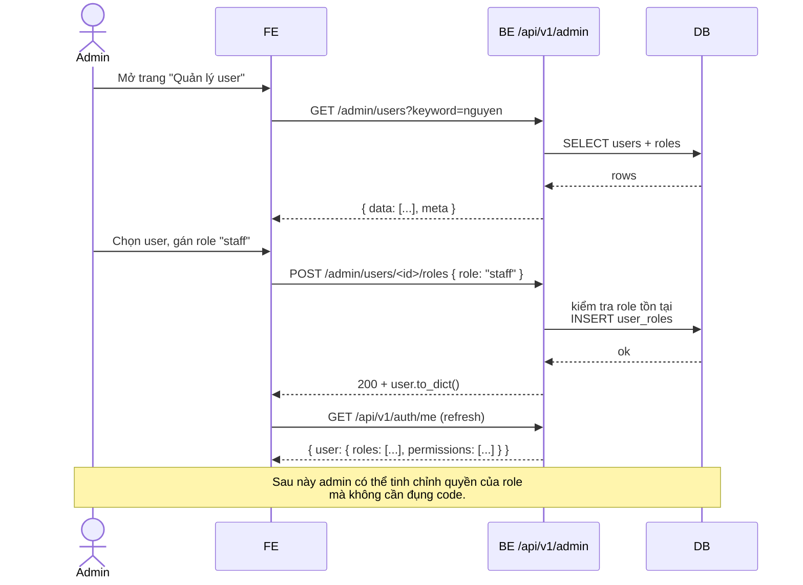

# RBAC (Role-Based Access Control) — Hướng dẫn cho BE & FE

> **Phiên bản: 1.7.0** — Bỏ role `patient` + 3 permission `rating:*` + toàn bộ
> tính năng đánh giá bác sĩ (model `DoctorRating`, service, API endpoints).
> Migration `1c2d3e4f5a6b` (drop bảng `doctor_ratings`, drop cột rating trên
> `doctor_statistics`).
>
> Phiên bản 1.6.0 (bỏ role `doctor` + `head_doctor_id`) — xem
> [Lịch sử thay đổi](#10-lịch-sử-thay-đổi).
>
> Phiên bản 1.5.0 (tách `patient:read`/`patient:manage`) — xem
> [Lịch sử thay đổi](#10-lịch-sử-thay-đổi).
>
> Tài liệu liên quan:
> - [`FE_RBAC.md`](./FE_RBAC.md) — Hướng dẫn FE gate UI theo permission.
> - [`FE_GOOGLE_LOGIN.md`](./FE_GOOGLE_LOGIN.md) — Đăng nhập Google OAuth.
> - [`FE_AUTH_TOKEN.md`](./FE_AUTH_TOKEN.md) — JWT, gọi API có bảo vệ.

---

## 1. Tổng quan

Hệ thống dùng **RBAC DB-driven**: role, permission và quan hệ giữa chúng nằm hoàn toàn trong DB.
BE dùng hằng số trong `app/common/roles.py` làm **seed ban đầu** và để gọi decorator (`@require_permission`)
một cách type-safe; về sau admin có thể đổi quyền của role mà **không cần sửa code**.

```
┌─────────┐         ┌─────────┐          ┌───────────────┐
│  users  │ ──<M:N>── │  roles  │ ──<M:N>──│ permissions  │
└─────────┘           └─────────┘          └───────────────┘
 user_roles              role_permissions
```

| Bảng | Diễn giải |
|---|---|
| `users` | Tài khoản (cột `is_active` bật/tắt, `google_sub` là OpenID subject) |
| `roles` | Vai trò (`admin`, `staff`, `patient`) — `doctor` đã bỏ (xem §1.1) |
| `permissions` | Quyền nguyên tử (`user:manage`, `record:read`, …) |
| `user_roles` | Bảng nối users ↔ roles |
| `role_permissions` | Bảng nối roles ↔ permissions |

> **User mới onboard** (đăng nhập Google lần đầu) tạo bản ghi ở `users`, **chưa gán role nào**
> → `roles = []`, `permissions = []`. Admin gán sau qua API.

### 1.1. Refactor 1.6.0 — bỏ role `doctor` và "trưởng khoa"

Từ phiên bản **1.6.0** (migration `1a2b3c4d5e6f`), hệ thống thay đổi mô hình phân quyền cho bác sĩ và khoa:

| Khái niệm | Trước | Sau (1.6.0) |
|---|---|---|
| Role `doctor` trên `users` | có — đánh dấu user là bác sĩ | **đã xóa**. "Ai là bác sĩ" giờ xác định qua entity `doctors` |
| `department_head` (đã gộp vào `staff` ở 1.3.0) | staff = lễ tân / điều dưỡng / **trưởng khoa** | staff = lễ tân / điều dưỡng / quản trị bác sĩ (không còn gắn với khoa) |
| Cột `departments.head_doctor_id` | FK `users.id` — buộc 1 user có role `doctor` | **đã drop** |
| `is_active` của department | suy ra `⇔ head_doctor_id IS NOT NULL` | do FE set trực tiếp qua POST/PATCH |
| Quyền staff lên bác sĩ | scoped theo khoa mà staff là trưởng | **toàn bộ** bác sĩ (mọi khoa) |

### 1.2. Refactor 1.7.0 — bỏ role `patient` và tính năng đánh giá

Từ phiên bản **1.7.0** (migration `1c2d3e4f5a6b`):

| Khái niệm | Trước | Sau (1.7.0) |
|---|---|---|
| Role `patient` trên `users` | có — đánh dấu user là bệnh nhân | **đã xóa**. Bệnh nhân không còn tài khoản/đăng nhập. |
| Permission `rating:read/write/manage` | có | **đã xóa** cùng DB mapping |
| Bảng `doctor_ratings` + cột `doctor_statistics.average_rating`/`total_ratings` | có | **đã drop** |
| API `/api/v1/ratings`, `/api/v1/doctors/{id}/ratings` | có | **đã xóa** |

Hệ quả: hệ thống chỉ còn 2 role (`admin`, `staff`) + 11 permission (xem §2.2).

**Ảnh hưởng tới FE (chồng lấn với §1.1)**:
- `GET /api/v1/admin/roles` chỉ trả về `["admin", "staff"]`.
- Role `patient` không thể gán qua API; trong `user.roles` sẽ không bao giờ xuất hiện.
- Các màn hình "đánh giá bác sĩ", form rating, danh sách rating đã bị xóa hoàn toàn — FE cần dọn dẹp tương ứng.

**Ảnh hưởng tới FE**:
- Role `doctor` không còn xuất hiện trong `GET /api/v1/admin/roles`, không thể gán qua `POST /admin/users/{id}/roles` (BE sẽ trả 400).
- Mọi endpoint / scope filter theo "khoa của bác sĩ trưởng khoa" không còn — staff xem được **tất cả** bác sĩ. Để giới hạn theo khoa, FE tự truyền `department_id` query param (xem `FE_DOCTOR.md`).
- Label "Trưởng khoa" trên UI không còn user riêng — FE có thể hiển thị khái niệm này dưới dạng "Khoa đang hoạt động" (icon ⏻ active/inactive) thay vì tên người.

---

## 2. Bảng role & permission hiện có

Code nguồn: `app/common/roles.py`. Đây là dữ liệu **seed** chạy khi migrate/init DB.

### 2.1. Roles

| Role | Ý nghĩa |
|---|---|
| `admin` | Quản trị — quản lý user, role, permission, khoa, triệu chứng. |
| `staff` | Nhân viên (lễ tân, điều dưỡng, **và** trưởng khoa cũ) — sau 1.6.0: quản lý **tất cả** bác sĩ (mọi khoa), không còn scope theo khoa cụ thể. |

> ⚠️ Từ 1.6.0 role `doctor` đã bị xóa khỏi hệ thống. Từ 1.7.0 role `patient`
> cũng đã bị xóa cùng toàn bộ tính năng đánh giá. Xem §1.1, §1.2 để biết lý do
> và ảnh hưởng.

### 2.2. Permissions

| Permission | Mô tả | Roles mặc định |
|---|---|---|
| `user:read` | Xem danh sách / chi tiết user | `admin` |
| `user:manage` | Gán/gỡ role, đổi trạng thái tài khoản | `admin` |
| `role:manage` | Tạo role, gán/gỡ permission | `admin` |
| `department:manage` | CRUD khoa | `admin`, `staff` |
| `symptom:manage` | CRUD triệu chứng & ánh xạ | `admin` |
| `patient:read` | Xem danh sách / chi tiết bệnh nhân | `admin`, `staff` |
| `patient:manage` | Tạo / sửa hồ sơ bệnh nhân | `admin`, `staff` |
| `record:read` | Xem hồ sơ sức khỏe | `admin`, `staff` |
| `record:write` | Tạo/sửa hồ sơ | `admin`, `staff` |
| `appointment:read` | Xem lịch hẹn | `admin`, `staff` |
| `appointment:manage` | Đổi trạng thái, hủy lịch hẹn | `admin` |

> **Note (1.7.0)**: 3 permission `rating:read/write/manage` đã bị xóa. Bảng trên
> khớp với `DEFAULT_ROLE_PERMISSIONS` trong `app/common/roles.py`.
> `user:*` dùng để quản lý tài khoản (admin); `patient:*` dùng để quản lý hồ sơ bệnh nhân
> (staff + admin). Nếu lẫn lộn, staff (lễ tân/điều dưỡng) sẽ không thể list/tạo bệnh nhân
> vì permission `user:read` chỉ có ở admin.

> Mapping trên là **mặc định khi seed**. Admin có thể gán/gỡ permission ở runtime mà không cần fix code.

---

## 3. Kiến trúc code

| Thành phần | File | Vai trò |
|---|---|---|
| Hằng số `Role` / `Permission` | `app/common/roles.py` | Seed + dùng trong decorator |
| Model DB | `app/models/rbac.py` | `Permission`, `Role`, bảng nối |
| Service | `app/services/user_service.py`, `app/services/role_service.py` | Business logic (không có HTTP/JSON) |
| Repository | `app/repositories/user_repository.py`, `app/repositories/role_repository.py` | Truy vấn DB |
| Middleware | `app/middleware/auth.py` (decorators `@require_permission`, `@require_role`, `@require_auth`) | Bảo vệ endpoint |
| Controller | `app/api/v1/admin.py` | Endpoint HTTP |

---

## 4. Decorators bảo vệ endpoint

```python
from app.middleware.auth import require_permission, require_role, require_auth
from app.common.roles import Permission, Role

# Bắt buộc đăng nhập.
@require_auth
def view_me(): ...

# Bắt buộc có ÍT NHẤT 1 permission trong tập.
@require_permission(Permission.USER_MANAGE)
def add_role(): ...

# Bắt buộc có ÍT NHẤT 1 role trong tập.
@require_role(Role.ADMIN, Role.STAFF)
def list_doctors(): ...
```

Nguyên tắc: **gate theo `permission`, không gate theo `role`**. Vì quyền của một role có thể bị admin
thu hồi qua API → nếu code hard-code `Role.ADMIN` thì BE sẽ "không chịu" admin nữa nếu bạn
vô hiệu hóa permission `role:manage` của họ. Permission là API hợp đồng; role là cách nhóm permission.

---

## 5. API quản lý User — gán / gỡ role

> Base URL: `/api/v1/admin`
> Tất cả yêu cầu `Authorization: Bearer <token>`.

### 5.1. Danh sách user (phân trang)

`GET /api/v1/admin/users?page=1&size=20` — cần `user:read`.

```jsonc
{
  "status": "success",
  "data": [
    { "id": 1, "email": "admin@hospital.com", "roles": ["admin"],
      "permissions": ["user:read", "user:manage", ...], "is_active": true }
  ],
  "meta": { "page": 1, "size": 20, "totalPage": 3 }
}
```

### 5.2. **Tìm kiếm & lọc** user

`GET /api/v1/admin/users/search` — cần `user:read`.

| Query | Mặc định | Mô tả |
|---|---|---|
| `keyword` | — | Khớp `LIKE` trên `email` hoặc `full_name` (case-insensitive) |
| `role` | — | Lọc user có role mang tên này |
| `is_active` | — | `true` / `false` |
| `page` | 1 | ≥ 1 |
| `size` | 20 | 1–100 |

Ví dụ:

```
GET /api/v1/admin/users/search?keyword=nguyen
GET /api/v1/admin/users/search?role=staff&is_active=true
GET /api/v1/admin/users/search?keyword=anh&role=admin&page=1&size=20
```

Response: giống mục 5.1 (mảng `data` + `meta`).

### 5.3. Chi tiết 1 user

`GET /api/v1/admin/users/<id>` — cần `user:read`.

```jsonc
{ "status": "success",
  "data": { "user": { "id": 2, "email": "...", "roles": ["staff"],
                       "permissions": ["record:read", "record:write"], "is_active": true } } }
```

### 5.4. **Gán role cho user** ⭐

`POST /api/v1/admin/users/<id>/roles` — cần `user:manage`.

```jsonc
// Request
{ "role": "staff" }

// 200 OK — user sau khi gán
{ "status": "success", "message": "Gán role cho user thành công.",
  "data": { "user": { "id": 2, "roles": ["staff"],
                       "permissions": ["record:read", "record:write"], ... } } }
```

- 404 nếu user hoặc role không tồn tại.
- 422 nếu thiếu `role` hoặc `role` rỗng.
- Idempotent: gán trùng role đã có sẽ không tạo row mới.

### 5.5. **Gỡ role khỏi user**

`DELETE /api/v1/admin/users/<id>/roles/<role_name>` — cần `user:manage`.

```
DELETE /api/v1/admin/users/2/roles/staff   -> 200
```

```jsonc
{ "status": "success", "message": "Gỡ role khỏi user thành công.",
  "data": { "user": { "id": 2, "roles": [], "permissions": [], ... } } }
```

### 5.6. Bật / tắt tài khoản (`is_active`)

`PATCH /api/v1/admin/users/<id>/status` — cần `user:manage`.

```jsonc
// Tắt tài khoản (chặn mọi thao tác và không cho đăng nhập lại)
PATCH /api/v1/admin/users/2/status
{ "is_active": false }
```

`true` để kích hoạt lại, `false` để vô hiệu hóa. **Không cho admin tự tắt tài khoản của mình** (`400`).

---

## 6. API quản lý Role & Permission

> Cùng base `/api/v1/admin`, cần permission `role:manage`.

### 6.1. Danh sách role

`GET /api/v1/admin/roles`

```jsonc
{ "status": "success",
  "data": [ { "id": 1, "name": "admin", "description": null,
              "permissions": ["role:manage", "user:manage", "user:read", ...] } ] }
```

### 6.2. Tạo role mới

`POST /api/v1/admin/roles`

```jsonc
// Request
{ "name": "nurse", "description": "Y tá khoa Nội" }
// 201 Created
{ "status": "success", "message": "Tạo role thành công.",
  "data": { "id": 5, "name": "nurse", "description": "Y tá khoa Nội", "permissions": [] } }
```

- 409 nếu tên role đã tồn tại.
- 422 nếu `name` rỗng hoặc vượt max length 64.

### 6.3. **Gán permission cho role** ⭐

`POST /api/v1/admin/roles/<id>/permissions`

```jsonc
POST /api/v1/admin/roles/5/permissions
{ "permission": "record:read" }

// 200
{ "status": "success", "message": "Gán permission cho role thành công.",
  "data": { "id": 5, "name": "nurse", "permissions": ["record:read"] } }
```

- 404 nếu role hoặc permission không tồn tại.
- Idempotent: gán trùng permission sẽ không tạo row mới.

### 6.4. Gỡ permission khỏi role

`DELETE /api/v1/admin/roles/<id>/permissions/<permission_name>`

```
DELETE /api/v1/admin/roles/5/permissions/record:read   -> 200
```

- Nếu permission chưa có trên role → no-op (200, không lỗi).

### 6.5. Danh sách permission (catalog)

`GET /api/v1/admin/permissions`

```jsonc
{ "status": "success",
  "data": [ { "id": 1, "name": "user:manage", "description": "Quản lý người dùng (gán/gỡ role)" }, ... ] }
```

Dùng để render danh sách check-box khi admin gán permission cho role.

---

## 7. Quy trình thực hành

### 7.1. Khi có user mới onboard từ Google

1. User đăng nhập lần đầu → BE tạo row trong `users`, `roles = []`, `permissions = []`.
2. Admin nhận được thông báo (hoặc thấy qua filter `role=<none>` — hiện trả về rỗng → xem ở
   `GET /admin/users` để tìm user chưa có role).
3. Admin vào `/admin/users`, search theo email → mở chi tiết.
4. Gọi `POST /admin/users/<id>/roles { "role": "staff" }` (hoặc role phù hợp — `staff` / `admin` / `patient`).
   Role `doctor` không còn tồn tại từ phiên bản 1.6.0.
5. User refresh trang (gọi lại `GET /api/v1/auth/me`) để nhận `permissions` mới.

### 7.2. Khi cấp quyền mới cho nhóm nhân viên

1. Tạo permission mới (nếu cần) — hiện tại BE chỉ có sẵn tập permission đã seed trong
   `app/common/roles.py`. Nếu muốn mở rộng: thêm hằng số → chạy `flask seed` (hoặc migration) → permission mới xuất hiện ở `GET /admin/permissions`.
2. Gọi `POST /admin/roles/<id_staff>/permissions { "permission": "<new>" }` để gán cho role.
3. Tất cả user mang role đó sẽ tự động có permission mới ở request kế tiếp.

### 7.3. Khi cần thu hồi quyền của 1 user cụ thể

Hai cách:

- **Thu hồi toàn role**: `DELETE /admin/users/<id>/roles/<role_name>`.
- **Ẩn quyền nhanh (mà không cần đụng role)**: dùng `PATCH /admin/users/<id>/status { "is_active": false }`
  → bị chặn **mọi** thao tác cho đến khi bật lại (`is_active: true`).

### 7.4. Khi tạo role mới cho case đặc biệt

```
1) POST /admin/roles { "name": "lab_tech", "description": "Kỹ thuật viên xét nghiệm" }
   -> lấy role id từ response.
2) POST /admin/roles/<id>/permissions { "permission": "record:read" }
   POST /admin/roles/<id>/permissions { "permission": "record:write" }
3) POST /admin/users/<user_id>/roles { "role": "lab_tech" }
```

User giờ có quyền của `lab_tech`. Nếu muốn tinh chỉnh lại: gỡ permission qua
`DELETE /admin/roles/<id>/permissions/<permission_name>`.

### 7.5. Sequence — cập nhật role và quyền cho user



---

## 8. Mẫu gọi API (curl)

> Thay `<TOKEN>` bằng JWT lấy từ `/api/v1/auth/me` sau khi đăng nhập.

```bash
# Lấy danh sách user
curl -H "Authorization: Bearer <TOKEN>" \
  "http://localhost:5000/api/v1/admin/users?page=1&size=20"

# Search user theo email
curl -H "Authorization: Bearer <TOKEN>" \
  "http://localhost:5000/api/v1/admin/users/search?keyword=nguyen"

# Gán role staff cho user id=2
curl -X POST -H "Authorization: Bearer <TOKEN>" \
  -H "Content-Type: application/json" \
  -d '{"role":"staff"}' \
  http://localhost:5000/api/v1/admin/users/2/roles

# Gỡ role patient khỏi user id=3
curl -X DELETE -H "Authorization: Bearer <TOKEN>" \
  http://localhost:5000/api/v1/admin/users/3/roles/patient

# Vô hiệu hóa tài khoản (chặn mọi thao tác)
curl -X PATCH -H "Authorization: Bearer <TOKEN>" \
  -H "Content-Type: application/json" \
  -d '{"is_active":false}' \
  http://localhost:5000/api/v1/admin/users/4/status

# Tạo role mới
curl -X POST -H "Authorization: Bearer <TOKEN>" \
  -H "Content-Type: application/json" \
  -d '{"name":"nurse","description":"Y tá"}' \
  http://localhost:5000/api/v1/admin/roles

# Gán permission cho role id=5
curl -X POST -H "Authorization: Bearer <TOKEN>" \
  -H "Content-Type: application/json" \
  -d '{"permission":"record:read"}' \
  http://localhost:5000/api/v1/admin/roles/5/permissions

# Gỡ permission khỏi role
curl -X DELETE -H "Authorization: Bearer <TOKEN>" \
  http://localhost:5000/api/v1/admin/roles/5/permissions/record:write

# Lấy catalog permission (để render form)
curl -H "Authorization: Bearer <TOKEN>" \
  http://localhost:5000/api/v1/admin/permissions
```

---

## 9. Checklist tích hợp

### Backend
- [x] Bảng RBAC được migrate (`users`, `roles`, `permissions`, `user_roles`, `role_permissions`).
- [x] Seed role & permission mặc định (`app/common/roles.py`).
- [x] Decorator `@require_permission` được áp dụng cho toàn bộ admin endpoints.
- [x] Google OAuth onboarding: `is_active = true`, **không gán role**.

### Frontend
- [ ] Lưu `user` (kèm `roles`, `permissions`) sau đăng nhập; refresh qua `GET /api/v1/auth/me` khi cần.
- [ ] Helper `hasPermission()` / `hasRole()`; gate theo `permissions` (xem `FE_RBAC.md`).
- [ ] Màn hình admin — User Management:
  - [ ] List + search theo email/name; filter theo `role` và `is_active`.
  - [ ] Xem chi tiết user + role + permission đang có.
  - [ ] Nút "Gán role" / "Gỡ role" (multi-select).
  - [ ] Nút "Bật/Tắt tài khoản" (ẩn nút tắt cho chính mình).
- [ ] Màn hình admin — Role & Permission:
  - [ ] List roles với description.
  - [ ] Tạo role mới.
  - [ ] Gán/gỡ permission cho role (dùng `GET /admin/permissions` để render checkbox).
- [ ] Phân biệt 401 (đăng xuất) và 403 (báo thiếu quyền/khóa tài khoản).
- [ ] **Sidebar/menu theo permission matrix** (§11.4).
- [ ] **Interceptor HTTP**: tự động đính `Authorization` + xử lý 401/403 (§11.5).
- [ ] **Refresh `permissions` khi admin đổi role** (§11.6) — không cần user đăng nhập lại.

---

## 10. Lịch sử thay đổi

| Phiên bản | Thay đổi |
|---|---|
| **1.7.0** | **Bỏ role `patient` + 3 permission `rating:*` + toàn bộ tính năng đánh giá**. Hệ thống chỉ còn 2 role (`admin`, `staff`). Migration `1c2d3e4f5a6b` drop bảng `doctor_ratings`, drop 2 cột `average_rating`/`total_ratings` trên `doctor_statistics`, xóa role `patient` (cascade) và 3 permission `rating:*` (cascade). Cập nhật §1.2, §2.1, §2.2, §11.9, §10. |
| **1.6.0** | **Bỏ role `doctor` và khái niệm "trưởng khoa" (`head_doctor_id`)**. Staff quản lý tất cả bác sĩ (mọi khoa); `is_active` của department do FE set trực tiếp. Cập nhật §1.1, §2.1, §2.2, §11.3, §11.4. Migration `1a2b3c4d5e6f` drop cột `departments.head_doctor_id` và xóa role `doctor` (cascade `user_roles` + `role_permissions`). |
| **1.5.0** | **Tách `patient:read`/`patient:manage` khỏi `user:*`**. Endpoints `/api/v1/patients` cũ gate bằng `user:read`/`user:manage` → staff/doctor bị 403. Thêm 2 permission mới + gán mặc định cho admin/staff/doctor (không có ở patient). Migration `7a8b9c0d1e2f`. Cập nhật §2.2, §11.4, §11.9. |
| **1.4.0** | Thêm §11 "Tích hợp FE": data shape của `user`, helper `hasPermission`/`hasRole`, sidebar/menu matrix theo permission, interceptor HTTP (401/403 handling), flow refresh permissions khi admin đổi role. Bump checklist FE tương ứng. |
| **1.3.0** | **Gộp role `department_head` vào `staff`** — staff giờ là cả trưởng khoa cũ. Permission `record:*`, `department:manage`, `appointment:read` được gộp vào permission mặc định của `staff`. Migration `6e7f8a9b0c1d` di chuyển user từ `department_head` sang `staff` và xóa role cũ. |

---

## 11. Tích hợp FE

> Phần này dành cho frontend. Nếu bạn đã đọc `FE_RBAC.md` thì §11.A và §11.B trùng —
> nhảy thẳng tới §11.4 (sidebar matrix) và §11.5 (interceptor) là đủ.

### 11.1. Data shape của user (lấy từ `/api/v1/auth/me`)

```jsonc
{
  "status": "success",
  "data": {
    "user": {
      "id": 3,
      "email": "hieu26ms13332@fsb.edu.vn",
      "full_name": "Nguyen Van Hieu",
      "picture": "https://lh3.googleusercontent.com/...",
      "email_verified": true,
      "is_active": true,
      "roles": ["staff"],
      "permissions": [
        "record:read",
        "record:write",
        "department:manage",
        "rating:read",
        "appointment:read"
      ],
      "last_login_at": "2026-07-12T08:30:00+00:00"
    }
  }
}
```

**Hợp đồng quan trọng** (FE bám theo):

| Trường | Kiểu | Dùng để |
|---|---|---|
| `id` | number | Set `actor.id` để ẩn nút "Tắt tài khoản" cho chính mình, hiển thị `Hồ sơ của tôi`. |
| `roles` | `string[]` | Hiển thị nhãn vai trò ("Quản trị viên", "Bác sĩ", "Nhân viên"…) trên header. **KHÔNG gate UI theo roles** — roles có thể admin thu hồi permission nhưng role vẫn còn (xem §11.3). |
| `permissions` | `string[]` | **Nguồn duy nhất để gate UI** (ẩn/hiện menu, nút, route). |
| `is_active` | bool | Khi `false` ⇒ user bị vô hiệu hóa. Tự đăng xuất + chuyển về `/login`. |
| `email_verified` | bool | Tùy chọn — hiện thông báo "Email chưa xác thực" nếu false. |

### 11.2. Helper pseudocode (TypeScript-first)

```typescript
// types/rbac.ts
export type Permission =
  | "user:read" | "user:manage" | "role:manage"
  | "department:manage" | "symptom:manage"
  | "patient:read" | "patient:manage"
  | "record:read" | "record:write"
  | "rating:read" | "rating:write" | "rating:manage"
  | "appointment:read" | "appointment:manage";

export interface SessionUser {
  id: number;
  email: string;
  full_name: string;
  is_active: boolean;
  roles: string[];
  permissions: Permission[];
  // ...
}

// stores/auth.ts (Zustand / Redux / Pinia — chọn cái bạn quen)
export const useAuth = () => {
  const user = useSessionUser();
  const isLoggedIn = !!user;

  const hasPermission = (...required: Permission[]) => {
    if (!user) return false;
    // Match ít nhất 1: cho phép UI gate linh hoạt (vd "Xem hoặc Sửa").
    return required.some((p) => user.permissions.includes(p));
  };

  const hasRole = (...roles: string[]) => {
    if (!user) return false;
    return roles.some((r) => user.roles.includes(r));
  };

  const requireAll = (...required: Permission[]) =>
    required.every((p) => user?.permissions.includes(p));

  return { user, isLoggedIn, hasPermission, hasRole, requireAll };
};

// <RequirePermission perm="user:manage">
// <RequirePermission perm={["record:read", "record:write"]}>  // any-of
function RequirePermission({
  perm, fallback = null, children,
}: { perm: Permission | Permission[]; fallback?: ReactNode; children: ReactNode }) {
  const { hasPermission } = useAuth();
  return hasPermission(...(Array.isArray(perm) ? perm : [perm])) ? <>{children}</> : <>{fallback}</>;
}

// Hook cho route guard
function useGuard(perm: Permission | Permission[]) {
  const { hasPermission } = useAuth();
  return hasPermission(...(Array.isArray(perm) ? perm : [perm]));
}
```

> **Vì sao gate theo `permission` chứ không theo `role`?** Admin có thể gỡ
> permission của một role mà vẫn giữ role. Nếu FE gate theo role thì vẫn cho
> user vào màn hình — nhưng BE sẽ trả 403 và user bị "khóa ngầm". Gate theo
> permission đảm bảo FE và BE đồng bộ.

### 11.3. Phân biệt gate theo permission vs theo role

| Tình huống | Dùng |
|---|---|
| Ẩn/hiện nút "Tạo khoa" | `hasPermission("department:manage")` |
| Ẩn/hiện nút "Xóa đánh giá" | `hasPermission("rating:manage")` |
| Ẩn/hiện menu "Bệnh nhân" (staff/admin) | `hasPermission("patient:read")` |
| Ẩn/hiện nút "Tạo bệnh nhân" (lễ tân) | `hasPermission("patient:manage")` |
| Ẩn/hiện menu "Quản trị" | `hasPermission("user:read")` (admin) |
| Hiển thị nhãn "Bác sĩ" trên header | `hasRole("staff") && đang ở màn hình bác sĩ` (chỉ hiển thị, không gate) |
| Ẩn/hiện màn hình "Profile của tôi" | `isLoggedIn` (luôn hiện) |
| Ẩn nút "Tắt tài khoản" cho chính mình | `user.id !== currentUser.id` |

### 11.4. Sidebar / menu matrix (gợi ý FE)

| Menu item | Permission gate | Mặc định hiển thị với role |
|---|---|---|
| Trang chủ / Dashboard | (luôn hiện) | mọi role |
| Đặt lịch hẹn của tôi | (luôn hiện) | patient |
| Hồ sơ của tôi (patient) | (luôn hiện) | patient |
| Danh sách bệnh nhân | `patient:read` | admin, staff |
| Tạo / sửa bệnh nhân | `patient:manage` | admin, staff |
| Lịch hẹn (admin/staff) | `appointment:read` | admin, staff |
| Hồ sơ sức khỏe (theo bệnh nhân) | `record:read` hoặc `record:write` | admin, staff |
| Khoa | `department:manage` | admin, staff |
| Bác sĩ | `department:manage` | admin, staff |
| Triệu chứng | `symptom:manage` | admin |
| Đánh giá bác sĩ — danh sách | `rating:manage` hoặc `rating:read` | admin, patient |
| **Quản trị** (group) | `user:read` | admin |
|  └ Users | `user:read` | admin |
|  └ Roles & Permissions | `role:manage` | admin |

Ví dụ render menu trong React:

```tsx
const menu = [
  { to: "/", label: "Trang chủ" },                                            // luôn
  { to: "/patients", label: "Bệnh nhân", perm: "patient:read" },              // staff/doctor/admin
  { to: "/patients/new", label: "Tạo bệnh nhân", perm: "patient:manage" },    // staff/admin
  { to: "/appointments", label: "Lịch hẹn", perm: "appointment:read" },
  { to: "/records", label: "Hồ sơ", perm: ["record:read", "record:write"] }, // any-of
  { to: "/departments", label: "Khoa", perm: "department:manage" },
  { to: "/doctors", label: "Bác sĩ", perm: "department:manage" },
  { to: "/symptoms", label: "Triệu chứng", perm: "symptom:manage" },
  { to: "/ratings", label: "Đánh giá", perm: ["rating:read", "rating:manage"] },
  { to: "/admin/users", label: "Users", perm: "user:read", group: "Quản trị" },
  { to: "/admin/roles", label: "Roles", perm: "role:manage", group: "Quản trị" },
];

function Sidebar() {
  const { hasPermission } = useAuth();
  return (
    <nav>
      {menu
        .filter((m) => !m.perm || hasPermission(...(Array.isArray(m.perm) ? m.perm : [m.perm])))
        .map((m) => <NavLink key={m.to} to={m.to}>{m.label}</NavLink>)}
    </nav>
  );
}
```

### 11.5. Interceptor HTTP — đính token + xử lý 401/403

> Endpoint auth gốc xem `FE_AUTH_TOKEN.md`. Phần dưới chỉ tập trung RBAC.

```typescript
// api/client.ts (axios interceptors)
import axios from "axios";
import { useAuth } from "@/stores/auth";
import { router } from "@/router";

export const api = axios.create({ baseURL: "/api/v1" });

// Request: tự đính Bearer token.
api.interceptors.request.use((config) => {
  const token = localStorage.getItem("access_token");
  if (token) config.headers.Authorization = `Bearer ${token}`;
  return config;
});

// Response: 401 → logout + về /login; 403 → toast "Bạn không có quyền".
api.interceptors.response.use(
  (res) => res,
  async (error) => {
    const status = error.response?.status;
    const message = error.response?.data?.message;
    const { refresh, logout } = useAuth.getState();

    if (status === 401) {
      // Hết hạn / token sai / tài khoản bị vô hiệu hóa.
      logout();
      router.push("/login?reason=expired");
    } else if (status === 403) {
      // Đăng nhập rồi nhưng thiếu permission, hoặc tài khoản bị tắt (`errors.account_disabled`).
      if (message?.includes("account_disabled")) {
        logout();
        router.push("/login?reason=disabled");
      } else {
        toast.error("Bạn không có quyền thực hiện thao tác này.");
      }
    }
    return Promise.reject(error);
  }
);
```

**Mapping status → action FE**:

| Status | Ý nghĩa | Action |
|---|---|---|
| `401` | Token thiếu / sai / hết hạn / đã logout (revoked) | Xoá localStorage → `/login?reason=expired` |
| `401` + `message="errors.account_disabled"` | Tài khoản bị vô hiệu hoá | Xoá localStorage → `/login?reason=disabled` |
| `403` | Đăng nhập rồi nhưng thiếu permission | Toast "Không có quyền" — KHÔNG logout |
| `429` | Rate limit | Retry sau `Retry-After` header |
| `5xx` | Lỗi server | Toast chung, log lỗi |

### 11.6. Refresh permissions khi admin đổi role

User thường gặp tình huống: **admin vừa gán/gỡ role của họ**, hoặc **admin vừa
tắt tài khoản của họ**. BE check quyền mỗi request (`require_auth` đọc user từ
DB), nhưng FE đang cache `permissions` trong store — cần refresh.

Có 3 cách:

**Cách A (khuyến nghị) — refresh khi user focus/return tab:**

```typescript
// App.tsx hoặc hook global
useEffect(() => {
  const onVisibilityChange = async () => {
    if (document.visibilityState === "visible" && useAuth.getState().isLoggedIn) {
      await useAuth.getState().refresh(); // gọi /api/v1/auth/me
    }
  };
  document.addEventListener("visibilitychange", onVisibilityChange);
  return () => document.removeEventListener("visibilitychange", onVisibilityChange);
}, []);
```

`refresh()` ở đây = `GET /api/v1/auth/me` rồi cập nhật store. Nếu user bị disable
→ response `403 errors.account_disabled` → interceptor ở §11.5 sẽ tự logout.

**Cách B — polling nhẹ mỗi 60s (cho màn hình admin):**

```typescript
useEffect(() => {
  const id = setInterval(() => useAuth.getState().refresh(), 60_000);
  return () => clearInterval(id);
}, []);
```

**Cách C — yêu cầu user bấm "Refresh" trên trang Admin.** Thủ công, fallback.

> **Không cần**: ép user đăng xuất/đăng nhập lại khi admin đổi role. Mọi request
> tiếp theo BE sẽ trả quyền mới — FE chỉ cần refresh `permissions` qua `/me`.

### 11.7. Tích hợp với màn hình Admin (User Management)

Khi admin gán role cho 1 user từ UI, FE **không cần** gọi lại `/me` cho chính
admin (admin đang thao tác, permission của admin không đổi). Nhưng nếu admin
muốn xem lại `permissions` mới của user đó, gọi `GET /admin/users/<id>` để có
data mới nhất.

Trên danh sách user, cột "Permissions" hiển thị:

```tsx
// /admin/users → render từng row
<td>
  {user.permissions.length === 0
    ? <span className="muted">Chưa có quyền</span>
    : (
      <ul className="chips">
        {user.permissions.slice(0, 3).map((p) => <li key={p}>{p}</li>)}
        {user.permissions.length > 3 && <li>+{user.permissions.length - 3}</li>}
      </ul>
    )}
</td>
```

Cột "Trạng thái" hiển thị badge `active` / `disabled`. Nút "Tắt" bị ẩn khi
`user.id === currentUser.id`. Gọi `PATCH /admin/users/<id>/status` để toggle,
sau đó update local state (không cần gọi lại GET).

### 11.8. Edge cases cần xử lý

1. **User chưa có role nào** (`roles=[], permissions=[]`):
   - Sau khi đăng nhập, FE kiểm tra `permissions.length === 0` → hiển thị màn
     hình "Tài khoản của bạn chưa được cấp quyền. Vui lòng liên hệ admin."
     (không tự logout — user vẫn có thể xem được lý do).
2. **Token hợp lệ nhưng user bị xóa / disabled**: server trả `401` hoặc
   `403 errors.account_disabled` → interceptor logout + đưa về `/login`.
3. **Permission được admin thêm mới**: FE cần `refresh()` mới thấy. Khi user
   mở tab mới → check `localStorage.getItem("last_refresh_at")` > 1 giờ → tự
   gọi `/me` để đồng bộ.
4. **`/me` trả `permissions = []` do admin vừa gỡ hết role**: KHÔNG crash UI.
   Hiển thị banner "Quyền của bạn vừa được thay đổi. Một số mục có thể bị ẩn."
   và ẩn các menu gated.
5. **Logout cưỡng bức từ admin** (`PATCH /status is_active=false`): user
   không nhận được signal realtime — chỉ phát hiện khi request tiếp theo.
   Cách A ở §11.6 giải quyết khi user focus tab.

### 11.9. Quick reference — bảng permission cho FE

```typescript
// lib/permissions.ts (canonical list — phải khớp với BE Permission.ALL)
export const PERMISSIONS = {
  USER_READ:       "user:read",
  USER_MANAGE:     "user:manage",
  ROLE_MANAGE:     "role:manage",
  DEPARTMENT_MANAGE: "department:manage",
  SYMPTOM_MANAGE:  "symptom:manage",
  PATIENT_READ:    "patient:read",
  PATIENT_MANAGE:  "patient:manage",
  RECORD_READ:     "record:read",
  RECORD_WRITE:    "record:write",
  RATING_READ:     "rating:read",
  RATING_WRITE:    "rating:write",
  RATING_MANAGE:   "rating:manage",
  APPOINTMENT_READ: "appointment:read",
  APPOINTMENT_MANAGE: "appointment:manage",
} as const;
```

> Nếu BE thêm permission mới (cập nhật `app/common/roles.py` rồi seed), FE
> cần update bảng này + permission matrix ở §11.4. Nên khai báo cùng chỗ và
> dùng TypeScript để FE compile-time bắt quên.
